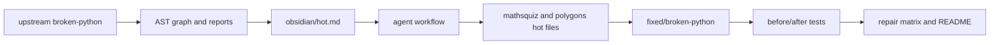
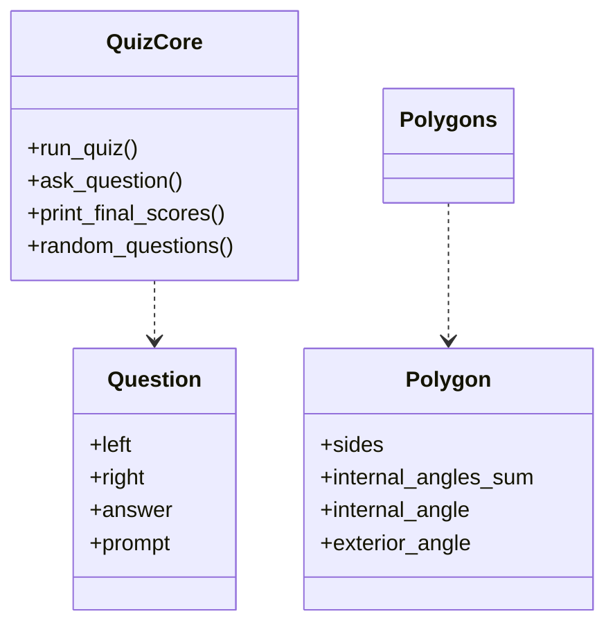

# EX04 - Graph-Guided Reverse Engineering of `martinpeck/broken-python`


This repository is a complete EX04 submission. It uses the real [`martinpeck/broken-python`](https://github.com/martinpeck/broken-python) repository as the selected bug source, recreates its broken files locally, adds a repaired copy under `fixed/`, proves the original failures with tests, proves the fixes with tests, and documents the reverse-engineering workflow with graph artifacts, Obsidian pages, reports, and token-efficiency evidence.

## Selected Repository

We selected [`martinpeck/broken-python`](https://github.com/martinpeck/broken-python) from the three allowed repositories:

1. `soarsmu/BugsInPy`
2. `martinpeck/broken-python`
3. `andela/buggy-python`

We chose `martinpeck/broken-python` because it is intentionally designed for students to debug and improve broken Python scripts. That makes it ideal for EX04: the repo is small enough to fully reverse-engineer, but still contains real syntax bugs, global-state bugs, incorrect formulas, import-time interaction problems, and refactoring opportunities. `BugsInPy` is more realistic but much heavier for environment setup, while `andela/buggy-python` is useful but less directly aligned with the compact educational debugging workflow required here.

## What Was Recreated

The upstream repository was cloned into:

```text
data/upstream_broken_python/
```

A repaired copy was added under:

```text
fixed/broken-python/
```

Fixed files:

| Upstream file | Fixed file | Main result |
|---|---|---|
| `mathsquiz/mathsquiz.py` | `fixed/broken-python/mathsquiz/mathsquiz.py` | Compiles in Python 3, asks 10 questions, scores correctly. |
| `mathsquiz/mathsquiz-step1.py` | `fixed/broken-python/mathsquiz/mathsquiz-step1.py` | Keeps checkpoint behavior while reducing repetition through shared core logic. |
| `mathsquiz/mathsquiz-step2.py` | `fixed/broken-python/mathsquiz/mathsquiz-step2.py` | Fixes the global `score` bug in final score reporting. |
| `mathsquiz/mathsquiz-step3.py` | `fixed/broken-python/mathsquiz/mathsquiz-step3.py` | Fixes the same global `score` bug and makes random questions testable. |
| `polygons/polygons.py` | `fixed/broken-python/polygons/polygons.py` | Compiles, validates sides, calculates general polygon formulas, draws the requested side count. |

The fixed maths quiz files share `fixed/broken-python/mathsquiz/quiz_core.py`, an improvement layer that removes duplication and makes interactive code testable.

## Bugs Found

### Maths Quiz Original Script

The original `mathsquiz.py` does not compile in Python 3. It mixes Python 2 `print` syntax with Python 3-style calls, uses assignment (`=`) inside `if` conditions, uses invalid `else if`, repeats `Question 1`, contains wrong multiplication answers, never increments `score`, and only partially implements the promised 10 questions.

### Maths Quiz Step 2 And Step 3

The checkpoint files introduce functions, but `print_final_scores(final_score)` and `print_final_scores(final_score, max_possible_score)` ignore their parameters and read the global variable `score`. That means the function can lie about the score if called with a different value.

### Polygons

The original `polygons.py` does not compile because it uses `new Polygon(...)`. It also inherits from undefined `Object`, hard-codes angle values only for triangles and squares, returns nonsense for other polygons, always draws six sides, and prompts for input at import time.

## Fix Strategy

The fixes are not only syntax patches. They are structural improvements:

- Move reusable quiz behavior into `quiz_core.py`.
- Use dependency injection for `input_fn` and `print_fn` so interactive code is testable.
- Replace global-score coupling with parameter-driven functions.
- Use correct multiplication answers and score increments.
- Add safe handling for non-integer quiz answers.
- Use the general polygon formula `(sides - 2) * 180`.
- Add polygon validation for side counts below 3.
- Guard interactive execution with `if __name__ == "__main__"`.

## Before / After Proof

The test suite contains side-by-side evidence:

- Broken upstream scripts fail with `SyntaxError` where expected.
- Broken checkpoint functions demonstrate the global score bug.
- Fixed scripts score correctly.
- Fixed polygon formulas work for triangles and pentagons.
- Fixed polygon validation rejects invalid side counts.
- The fixed folder recreates the upstream Python files.

Run:

```powershell
.\.venv\Scripts\python.exe -m unittest discover -s tests
```

Current result:

```text
Ran 17 tests in 0.022s
OK
```

## Execution Iteration Example

The screenshots below show the practical iteration from broken execution to fixed execution for the maths quiz example. This is important because the assignment asks for visible before/after proof, not only a written explanation.

### Broken Upstream Run


The broken upstream file demonstrates the original failure state. In the original repo, `mathsquiz.py` contains syntax and logic problems that prevent normal Python 3 execution and make the scoring behavior unreliable.

### Fixed Run


The fixed version runs to completion, asks all 10 questions, checks correct answers, increments the score, and prints an accurate final result. For example, one wrong answer and nine correct answers produce `9 points out of a possible 10`.

## Graph-Guided Workflow

The investigation follows the EX04 graph-first idea:



The point is not to read every line blindly. The workflow first reads `obsidian/index.md`, `obsidian/hot.md`, and reports, then drills into the hot files: `mathsquiz.py`, `mathsquiz-step2.py`, `mathsquiz-step3.py`, and `polygons.py`.

## OOP / Design View



## Token Efficiency

| Mode | Estimated tokens | Files read | Iterations | Result |
|---|---:|---:|---:|---|
| Naive raw-code reading | 6,166 | 15 | 5 | Reads broad source before forming a focused hypothesis. |
| Graph-guided reading | 3,266 | 5 | 2 | Starts from hot context and repair matrix, then reads only relevant code. |

The graph-guided route saves about 47 percent of estimated context tokens in the current project.

## Important Files

| Path | Purpose |
|---|---|
| `data/upstream_broken_python/` | Local recreation of the selected upstream repo. |
| `fixed/broken-python/` | Fixed copy of the upstream broken scripts. |
| `tests/test_broken_python_fixed.py` | Before/after tests proving original bugs and fixed behavior. |
| `reports/BROKEN_PYTHON_REPAIR_MATRIX.md` | File-by-file bug and fix matrix. |
| `reports/BUG_ANALYSIS.md` | Root-cause analysis of the upstream bugs. |
| `reports/OPTIMIZATION_REPORT.md` | Explanation of code-quality improvements beyond bug fixes. |
| `obsidian/index.md` and `obsidian/hot.md` | Obsidian-style graph navigation entry points. |
| `assets/images/reverse-engineering-hero.png` | Generated README visual for the project narrative. |

## Run Instructions

Create and activate the environment:

```powershell
py -3 -m venv .venv
.\.venv\Scripts\Activate.ps1
python -m pip install -e .
```

Run all verification:

```powershell
python -m unittest discover -s tests
python -m gaphify_re agent --repo .
python -m gaphify_re tokens --repo .
python -m gaphify_re graph --repo .
```

## Repository Structure

```text
assets/images/              generated README visual
data/upstream_broken_python/ recreated selected upstream repository
fixed/broken-python/        repaired copy of upstream scripts
docs/                       PRD, todo list, worklog
obsidian/                   linked knowledge vault
reports/                    bug, repair, graph, token, optimization reports
src/gaphify_re/             local graph/agent/token tooling
tests/                      before/after tests
ref/                        local assignment PDFs, ignored by Git
```

## Self Score

| Requirement | Self score | Evidence |
|---|---:|---|
| Selected one allowed repository and justified choice | 10/10 | `martinpeck/broken-python` is named and justified in this README and reports. |
| Recreated and fixed buggy source files | 10/10 | Upstream files are in `data/upstream_broken_python/`; repaired files are in `fixed/broken-python/`. |
| Bug investigation and root-cause explanation | 9/10 | Reports explain syntax failures, global-score coupling, and polygon formula/design issues. |
| Before/after proof | 10/10 | `tests/test_broken_python_fixed.py`, repair matrix, and execution screenshots prove the change. |
| Grphify/graph-style representation | 8/10 | `artifacts/graph.json` and `reports/GRAPH_REPORT.md` provide AST-based graph evidence. |
| Obsidian vault documentation | 9/10 | `obsidian/index.md`, `hot.md`, architecture, bug investigation, agent workflow, and token pages are included. |
| Agent workflow | 8/10 | Deterministic graph-guided workflow is implemented, with optional LangGraph adapter support. |
| Token-efficiency comparison | 9/10 | Naive vs graph-guided token report is measured and documented. |
| Professional repository structure and docs | 10/10 | `docs/`, `reports/`, `tests/`, `src/`, `fixed/`, `assets/`, and `.gitignore` are present. |
| Original extensions and improvements | 9/10 | Shared quiz core, testable IO injection, general polygon formulas, generated visual asset, and 900-task checklist. |

Estimated overall self score: **92/100**. The strongest parts are the real before/after tests, fixed upstream copy, README evidence, and documentation. The main remaining improvement would be running a real external Grphify/Obsidian visual export if the grading environment expects the exact tool rather than the local AST graph equivalent.


