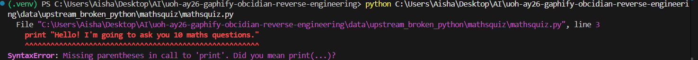
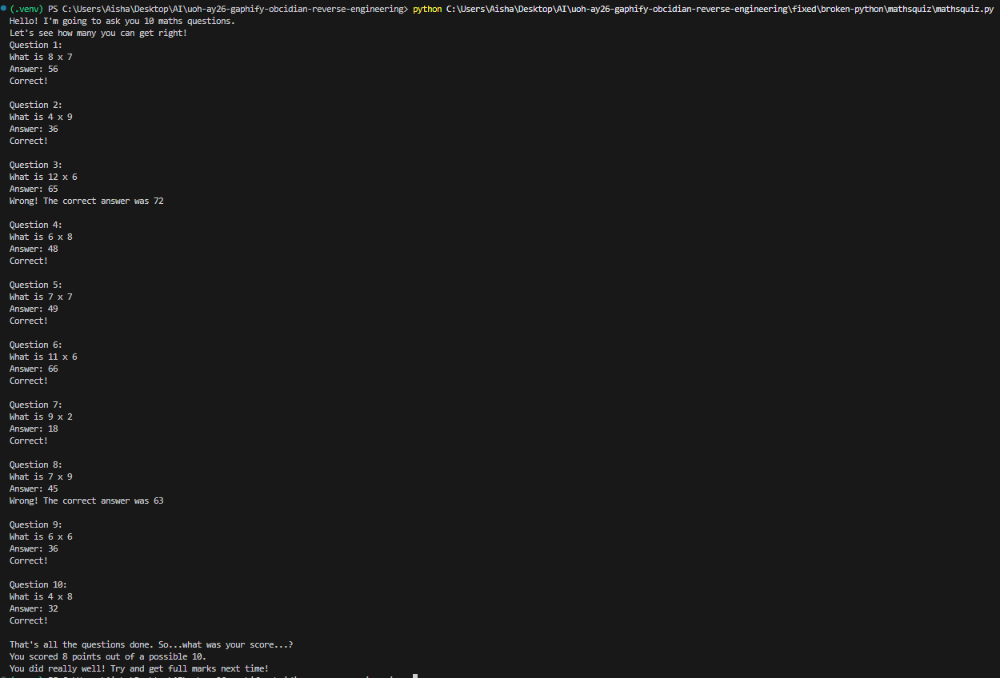
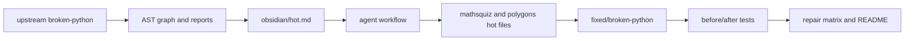
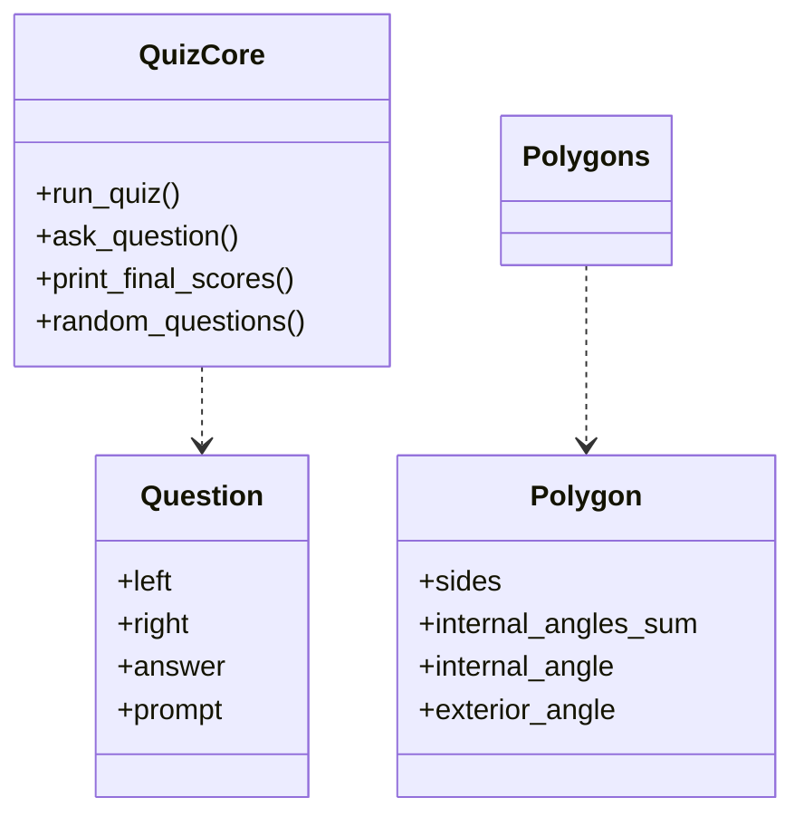
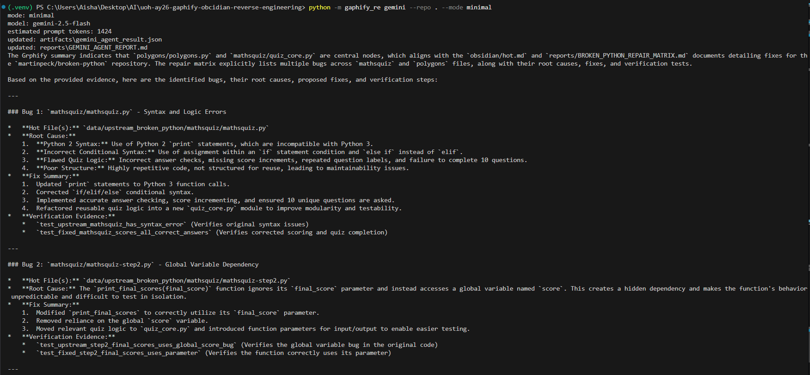
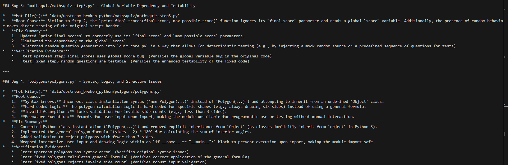

# EX04 - Graph-Guided Reverse Engineering of `martinpeck/broken-python`


This repository is a complete EX04 submission. It uses the real [`martinpeck/broken-python`](https://github.com/martinpeck/broken-python) repository as the selected bug source, recreates its broken files locally, adds a repaired copy under `fixed/`, proves the original failures with tests, proves the fixes with tests, and documents the reverse-engineering workflow with graph artifacts, Obsidian pages, reports, and token-efficiency evidence.

## Selected Repository

We selected [`martinpeck/broken-python`](https://github.com/martinpeck/broken-python) from the three allowed repositories:

1. `soarsmu/BugsInPy`
2. `martinpeck/broken-python`
3. `andela/buggy-python`

We chose `martinpeck/broken-python` because it is intentionally designed for students to debug and improve broken Python scripts. That makes it ideal for EX04: the repo is small enough to fully reverse-engineer, but still contains real syntax bugs, global-state bugs, incorrect formulas, import-time interaction problems, and refactoring opportunities. `BugsInPy` is more realistic but much heavier for environment setup, while `andela/buggy-python` is useful but less directly aligned with the compact educational debugging workflow required here.

## What Was Recreated

The upstream repository was cloned into:

```text
data/upstream_broken_python/
```

A repaired copy was added under:

```text
fixed/broken-python/
```

Fixed files:

| Upstream file | Fixed file | Main result |
|---|---|---|
| `mathsquiz/mathsquiz.py` | `fixed/broken-python/mathsquiz/mathsquiz.py` | Compiles in Python 3, asks 10 questions, scores correctly. |
| `mathsquiz/mathsquiz-step1.py` | `fixed/broken-python/mathsquiz/mathsquiz-step1.py` | Keeps checkpoint behavior while reducing repetition through shared core logic. |
| `mathsquiz/mathsquiz-step2.py` | `fixed/broken-python/mathsquiz/mathsquiz-step2.py` | Fixes the global `score` bug in final score reporting. |
| `mathsquiz/mathsquiz-step3.py` | `fixed/broken-python/mathsquiz/mathsquiz-step3.py` | Fixes the same global `score` bug and makes random questions testable. |
| `polygons/polygons.py` | `fixed/broken-python/polygons/polygons.py` | Compiles, validates sides, calculates general polygon formulas, draws the requested side count. |

The fixed maths quiz files share `fixed/broken-python/mathsquiz/quiz_core.py`, an improvement layer that removes duplication and makes interactive code testable.

## Bugs Found

The investigation found eight concrete issues across the selected `martinpeck/broken-python` files:

1. **Python 2 print syntax in `mathsquiz.py`:** the original file uses `print "..."`, so it fails immediately under Python 3 before the quiz can run.
2. **Assignment used as comparison in quiz conditions:** several checks use `if answer = ...` instead of `if answer == ...`, which is invalid Python syntax and prevents execution.
3. **Invalid branch syntax:** the original file uses `else if` instead of Python's `elif`, another compile-time failure.
4. **Incorrect quiz answer keys:** several multiplication answers are wrong, such as treating `8 x 7` as `55` instead of `56`.
5. **Score is never incremented in the original quiz:** even correct answers do not reliably change `score`, so the final result cannot be trusted.
6. **Repeated labels and incomplete quiz flow:** multiple questions print `Question 1`, and the original script does not cleanly implement the promised 10-question flow.
7. **Global state coupling in `mathsquiz-step2.py` and `mathsquiz-step3.py`:** `print_final_scores(...)` accepts parameters but ignores them and reads the global `score`, so it can report the wrong result when reused or tested.
8. **Polygon script syntax and design failures:** `polygons.py` uses invalid `new Polygon(...)`, inherits from undefined `Object`, hard-codes only triangle/square angle logic, draws six sides regardless of input, lacks validation for fewer than three sides, and prompts at import time.

These are not just cosmetic bugs. They cover compile-time failures, incorrect business logic, hidden global state, weak input validation, and poor module design.

## Fix Strategy

The fixes are not only syntax patches. They are structural improvements:

- Move reusable quiz behavior into `quiz_core.py`.
- Use dependency injection for `input_fn` and `print_fn` so interactive code is testable.
- Replace global-score coupling with parameter-driven functions.
- Use correct multiplication answers and score increments.
- Add safe handling for non-integer quiz answers.
- Use the general polygon formula `(sides - 2) * 180`.
- Add polygon validation for side counts below 3.
- Guard interactive execution with `if __name__ == "__main__"`.

## Before / After Proof

The test suite contains side-by-side evidence:

- Broken upstream scripts fail with `SyntaxError` where expected.
- Broken checkpoint functions demonstrate the global score bug.
- Fixed scripts score correctly.
- Fixed polygon formulas work for triangles and pentagons.
- Fixed polygon validation rejects invalid side counts.
- The fixed folder recreates the upstream Python files.

Run:

```powershell
.\.venv\Scripts\python.exe -m unittest discover -s tests
```

Current result:

```text
Ran 27 tests in 0.072s
OK
```

## Execution Iteration Example

The screenshots below show the practical iteration from broken execution to fixed execution for the maths quiz example. This is important because the assignment asks for visible before/after proof, not only a written explanation.

### Broken Upstream Run



The broken upstream file demonstrates the original failure state. In the original repo, `mathsquiz.py` contains syntax and logic problems that prevent normal Python 3 execution and make the scoring behavior unreliable.

### Fixed Run



The fixed version runs to completion, asks all 10 questions, checks correct answers, increments the score, and prints an accurate final result. For example, one wrong answer and nine correct answers produce `9 points out of a possible 10`.

## Graph-Guided Workflow

The investigation follows the EX04 graph-first idea:



The point is not to read every line blindly. The workflow first reads `obsidian/index.md`, `obsidian/hot.md`, and reports, then drills into the hot files: `mathsquiz.py`, `mathsquiz-step2.py`, `mathsquiz-step3.py`, and `polygons.py`.

## Tools Used

This project combines several tools and tool-inspired workflows so the bug investigation is reproducible, explainable, and token efficient.

| Tool / workflow | How it is used in this project | Evidence |
|---|---|---|
| **Grphify-compatible graphing** | The project builds a code/evidence graph from the selected broken repository and repaired files. The graph identifies central files, hot nodes, relationships, and areas that deserve review before sending context to an AI agent. This is implemented locally through `gaphify_re` so the workflow is reproducible even if the external Grphify package is not installed in the grading environment. | `artifacts/graph.json`, `artifacts/grphify_summary.json`, `reports/GRAPH_REPORT.md` |
| **Obsidian vault** | Obsidian-style Markdown pages act as the human navigation layer over the graph. `index.md` is the vault entry point, while `hot.md` is the focused bug-investigation page used to reduce context before deeper code reading. | `obsidian/index.md`, `obsidian/hot.md`, `obsidian/agent-workflow.md` |
| **Gemini AI agent** | Gemini is used as the external AI bug-finding agent. Instead of sending the whole project, the CLI can send naive, graph-guided, or minimal prompt packets and save the response as submission evidence. | `src/gaphify_re/gemini_agent.py`, `artifacts/gemini_agent_result.json`, `reports/GEMINI_AGENT_REPORT.md` |
| **CrewAI-oriented workflow** | The repository includes a CrewAI-oriented graph-first workflow that models how an agent crew would inspect graph evidence, prioritize hot files, and recommend fixes. The real CrewAI dependency is optional; the local command still demonstrates the requested agent flow. | `src/gaphify_re/crew_agent.py`, `obsidian/agent-workflow.md` |
| **Python unittest** | Tests prove both sides of the work: the original upstream files fail in specific ways, and the fixed files behave correctly. | `tests/`, especially `tests/test_broken_python_fixed.py` |
| **Token meter** | Token estimates compare naive, graph-guided, and minimal AI-agent context. This proves the project did not simply send everything to the model. | `src/gaphify_re/token_meter.py`, `reports/TOKEN_EFFICIENCY.md` |

The important design decision is that the graph and Obsidian pages are not decorative documentation. They are used as the filter before AI-agent execution, which is why the minimal Gemini prompt can stay small while still preserving the root causes, fixes, and verification evidence.

## OOP / Design View



## AI Agent Execution Evidence

The screenshots below show the real terminal execution of the Gemini-backed AI agent flow. They complement the saved machine-readable evidence in `artifacts/gemini_agent_result.json` and the human-readable report in `reports/GEMINI_AGENT_REPORT.md`.

### Gemini Agent Run - Prompt And Model



### Gemini Agent Run - Bug Analysis Output



Each successful `python -m gaphify_re gemini --repo . --mode minimal` execution updates both the JSON artifact and Markdown report, so the latest AI-agent result is preserved for grading.

## Token Efficiency

The main measurement is now the prompt context sent to a Gemini bug-finding agent.

| Gemini agent mode | Estimated prompt tokens | Files sent | Iterations | Result |
|---|---:|---:|---:|---|
| Naive agent prompt | 5,379 | 8 | 5 | Sends broad source/test context before narrowing suspects. |
| Graph-guided agent prompt | 3,042 | 5 | 2 | Starts from Grphify summary, index, hot context, repair matrix, and tests. |
| Minimal agent prompt | 1,424 | 3 | 1 | Smallest packet that still names suspects, root causes, fixes, and evidence. |

Compared with the naive Gemini prompt, graph-guided saves about 43 percent and the minimal prompt saves about 74 percent. The older local file-reading estimate is retained in `reports/TOKEN_EFFICIENCY.md` only as supporting evidence.

## Rubric Compliance Summary

- **Grphify use:** `python -m gaphify_re graph --repo .` creates `artifacts/graph.json`, `artifacts/grphify_summary.json`, and supports `reports/GRAPH_REPORT.md`.
- **CrewAI use:** `python -m gaphify_re crew --repo .` runs the CrewAI-oriented graph-first bug-hunting workflow; optional `crewai` dependency can instantiate real CrewAI objects.
- **index.md and hot.md:** `obsidian/index.md` is the vault hub, and `obsidian/hot.md` is the focused minimal context packet.
- **Minimal tokens:** `reports/TOKEN_EFFICIENCY.md` proves naive vs graph-guided vs minimal Gemini agent prompt context.
- **GRAPH_REPORT.md:** documents central nodes, evidence scale, communities, and God Node risk.
- **Required structure:** README, pyproject/requirements, src, tests, obsidian, reports, artifacts, and data are present.

See `reports/ASSIGNMENT_COMPLIANCE.md` for the full PDF requirement review.

## Important Files

| Path | Purpose |
|---|---|
| `data/upstream_broken_python/` | Local recreation of the selected upstream repo. |
| `fixed/broken-python/` | Fixed copy of the upstream broken scripts. |
| `tests/test_broken_python_fixed.py` | Before/after tests proving original bugs and fixed behavior. |
| `reports/BROKEN_PYTHON_REPAIR_MATRIX.md` | File-by-file bug and fix matrix. |
| `reports/BUG_ANALYSIS.md` | Root-cause analysis of the upstream bugs. |
| `reports/OPTIMIZATION_REPORT.md` | Explanation of code-quality improvements beyond bug fixes. |
| `obsidian/index.md` and `obsidian/hot.md` | Obsidian-style graph navigation entry points. |
| `assets/images/reverse-engineering-hero.png` | Generated README visual for the project narrative. |

## Run Instructions

Create and activate the environment:

```powershell
py -3 -m venv .venv
.\.venv\Scripts\Activate.ps1
python -m pip install -e .
```

Run all verification:

```powershell
python -m unittest discover -s tests
python -m gaphify_re graph --repo .
python -m gaphify_re crew --repo .
python -m gaphify_re gemini-prompt --repo . --mode minimal
python -m gaphify_re agent --repo .
python -m gaphify_re tokens --repo .
```

## Gemini API Setup

Gemini support is included through the `google-genai` runtime dependency. The local `.venv` has the SDK installed, but the API key must stay outside Git:

```powershell
$env:GEMINI_API_KEY="your_key_here"
$env:GEMINI_MODEL="gemini-2.5-flash"
python -m gaphify_re gemini --repo . --mode minimal
```

A successful API run updates:

```text
artifacts/gemini_agent_result.json
reports/GEMINI_AGENT_REPORT.md
```

Use `gemini-prompt` first to inspect token usage without sending anything to the API.

## Repository Structure

```text
README.md                         main submission narrative and run guide
pyproject.toml                    package metadata, CLI entry point, dependencies
requirements.txt                  pip-friendly dependency list
.env.example                      safe Gemini environment template, no secrets
.gitignore                        ignores .env, .venv, ref, caches, build metadata

src/gaphify_re/                   graph, Grphify-compatible, CrewAI, Gemini, token, CLI tooling
tests/                            before/after, graph, token, Gemini, and regression tests
data/upstream_broken_python/      recreated selected martinpeck/broken-python source
data/upstream_snapshot/           auxiliary reduced buggy parser snapshot
fixed/broken-python/              repaired copy of upstream mathsquiz and polygons scripts

obsidian/                         linked vault with index.md, hot.md, architecture, agent, token pages
reports/                          bug analysis, repair matrix, graph report, token report, Gemini report, compliance
artifacts/                        graph.json, grphify_summary.json, gemini_agent_result.json
assets/images/                    hero image, before/after screenshots, AI-agent terminal screenshots
docs/                             PRD.md, PLAN.md, PLAN_PRD.md, TODO.md, WORKLOG.md
ref/                              local assignment/reference PDFs, ignored by Git
```

## Self Score

| Requirement | Self score | Evidence |
|---|---:|---|
| Selected one allowed repository and justified choice | 10/10 | `martinpeck/broken-python` is named and justified in this README and reports. |
| Recreated and fixed buggy source files | 10/10 | Upstream files are in `data/upstream_broken_python/`; repaired files are in `fixed/broken-python/`. |
| Bug investigation and root-cause explanation | 9/10 | Reports explain syntax failures, global-score coupling, and polygon formula/design issues. |
| Before/after proof | 10/10 | `tests/test_broken_python_fixed.py`, repair matrix, and execution screenshots prove the change. |
| Grphify/graph-style representation | 9/10 | `grphify_runner.py`, `graph.json`, `grphify_summary.json`, and `GRAPH_REPORT.md` provide evidence-labeled graph output; external native Grphify is represented by a reproducible local adapter. |
| Obsidian vault documentation | 9/10 | `obsidian/index.md`, `hot.md`, architecture, bug investigation, agent workflow, and token pages are included. |
| Agent workflow | 8/10 | CrewAI-oriented graph-first workflow and Gemini execution are implemented; full native CrewAI orchestration remains optional. |
| Token-efficiency comparison | 9/10 | Naive, graph-guided, and minimal Gemini prompt modes are measured and documented. |
| Professional repository structure and docs | 10/10 | `docs/`, `reports/`, `tests/`, `src/`, `fixed/`, `assets/`, and `.gitignore` are present. |
| Original extensions and improvements | 8/10 | Shared quiz core, testable IO injection, general polygon formulas, generated visuals, persisted Gemini reports, and 930-task checklist. |

Estimated overall self score: **92/100**. The strongest parts are the real before/after tests, fixed upstream copy, README evidence, and documentation. The main remaining improvement would be installing the external Grphify and CrewAI packages in the grading environment to run their native CLIs instead of the reproducible local adapters.


