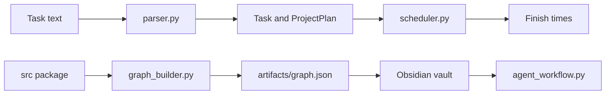
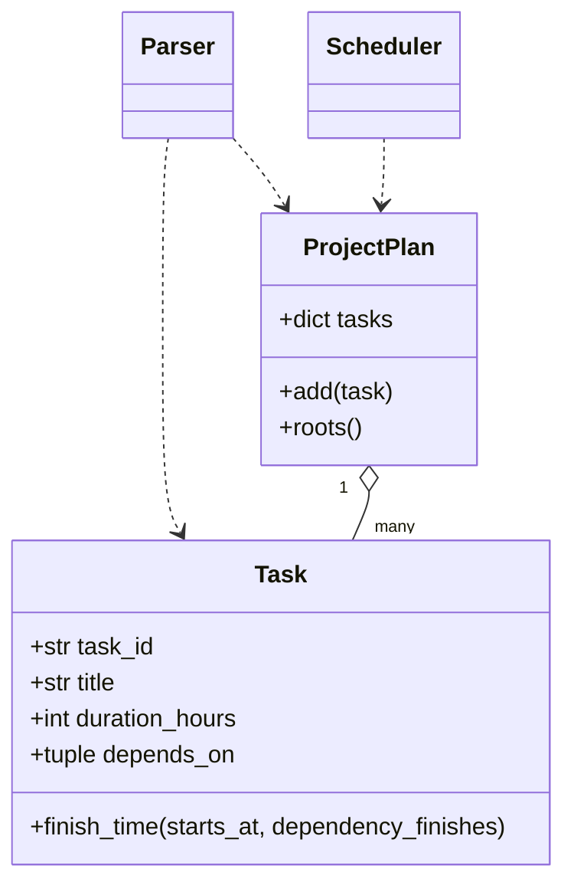

# Architecture

## Block Diagram

## OOP Diagram

## Extracted Insight

The original bug is architectural, not syntactic. Validation belongs after parsing has established the complete task-id universe.
